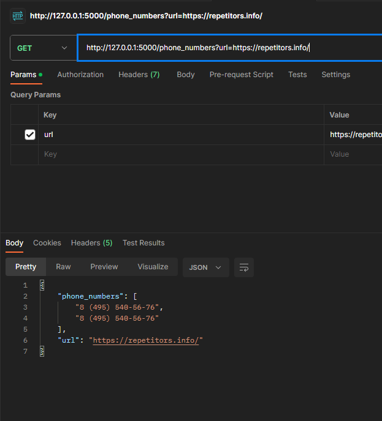

# repo_flask

парсер номеров телефона сайта

1. Клонирование проекта git clone https://github.com/OlzhasKALIEV/repo_flask.git
2. Установка зависимосетей команда: pip install -r .\requirements.txt
3. Запустить сервер: python .\app.py run

Обработка запроса в Postman

GET: http://127.0.0.1:5000/phone_numbers?url=https://repetitors.info/

